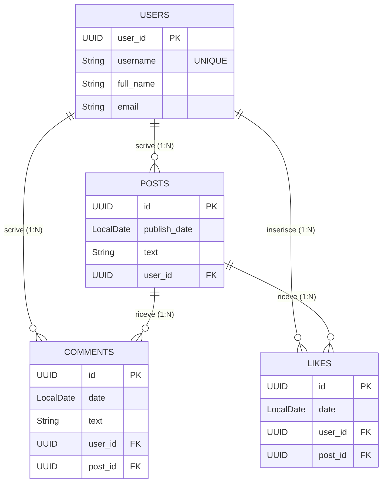
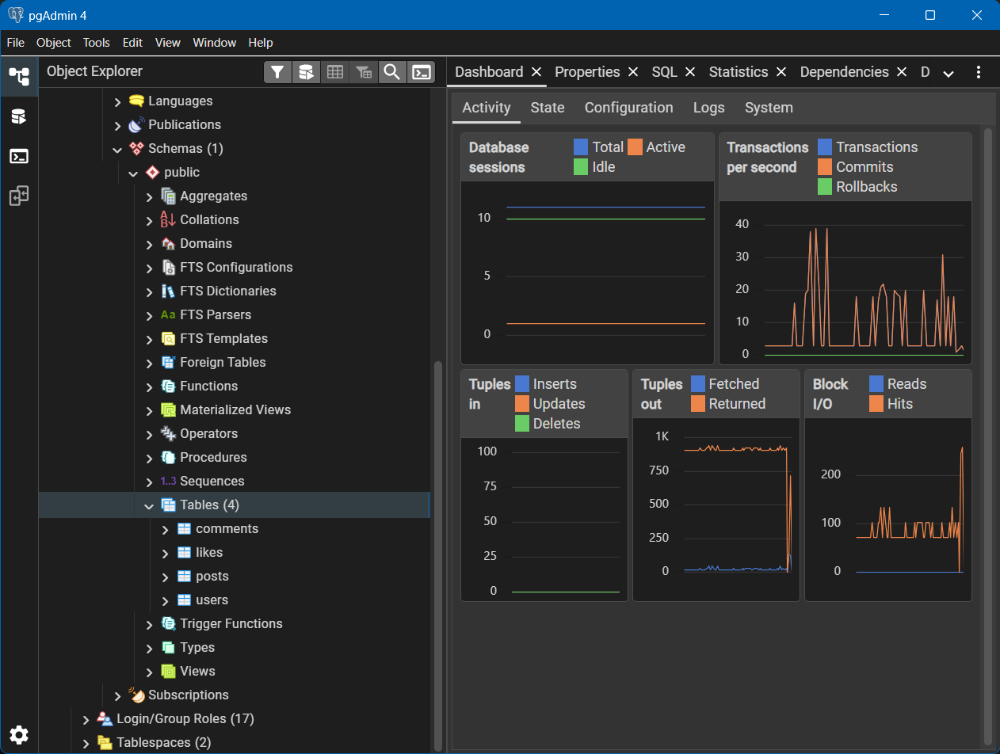
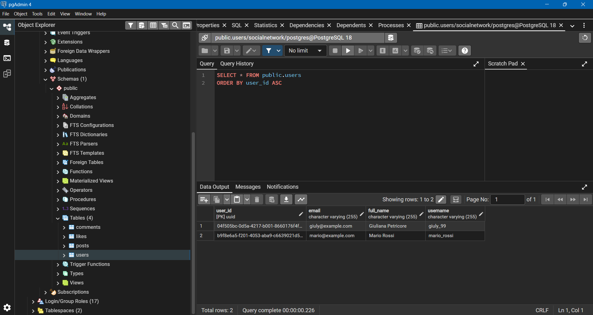

# Social Network - Backend (Progetto Settimana 14)

Questo progetto è un'applicazione backend realizzata con **Spring Boot** per la gestione di un semplice Social Network. Implementa la persistenza dei dati attraverso **Spring Data JPA** e si interfaccia con un database **PostgreSQL**.

## 🛠️ Tecnologie Utilizzate
* **Java 17+**
* **Spring Boot** (Web, Data JPA)
* **PostgreSQL** (Database relazionale)
* **Hibernate** (ORM)
* **Maven** (Gestione dipendenze)

---

## 📊 Modello Dati e Scelte Progettuali

L'applicazione gestisce quattro entità principali: `User`, `Post`, `Comment` e `Like`.
Per strutturare il database relazionale, ho implementato le seguenti relazioni:

* **User - Post (One-to-Many):** Un utente può scrivere molti post, ma ogni post appartiene a un solo utente (`@OneToMany` lato User, `@ManyToOne` lato Post).
* **User - Comment (One-to-Many):** Un utente può scrivere numerosi commenti sotto diversi post. Ogni commento è scritto da un singolo utente (`@ManyToOne` su Comment).
* **Post - Comment (One-to-Many):** Un post può ricevere svariati commenti, ma ogni commento è legato in modo univoco a un singolo post.
* **User - Like & Post - Like (Many-to-Many risolto con entità debole):** Invece di una semplice associazione Many-to-Many, ho creato un'entità `Like` esplicita. Questo permette di tracciare metadati aggiuntivi (come la data in cui è stato messo il like). Un utente può mettere like a più post e un post può avere like da più utenti.

### Diagramma ER

Di seguito la rappresentazione delle entità e delle loro relazioni:

## ⚙️ Logica di Business Applicativa
Oltre alla gestione standard CRUD nel livello Service, è stato implementato un vincolo di integrità logica sui Like:

Uno stesso utente non può mettere più di un like allo stesso post.

Per soddisfare questo requisito e ottimizzare il controllo, il metodo save() all'interno del LikesService recupera l'intera collezione dei Like dal database e utilizza gli Stream di Java (.stream().anyMatch(...)) per verificare se esiste già una combinazione identica di user_id e post_id. Se la condizione si verifica, l'applicazione blocca il salvataggio sollevando una BadRequestException.

## 🧪 Testing tramite CommandLineRunner
L'applicazione include un componente SocialNetworkRunner che, all'avvio dell'applicazione, popola automaticamente il database per testare le funzionalità.
Il runner esegue le seguenti operazioni:

Crea e salva due utenti di test.

Crea e salva un post assegnato al primo utente.

Inserisce un commento al post da parte del secondo utente.

Inserisce un Like valido al post.

Testa il vincolo di unicità: Tenta di inserire un secondo Like con gli stessi autori, dimostrando che il Service blocca correttamente l'operazione intercettando l'eccezione personalizzata.

## 📸 Screenshot di Verifica (pgAdmin)
(Nota per il docente: Gli screenshot delle tabelle generate e dei dati popolati dal Runner sono presenti nella cartella principale di questa repository).

